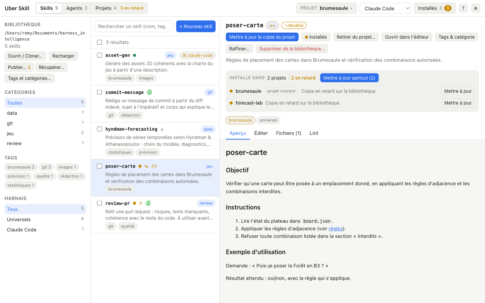
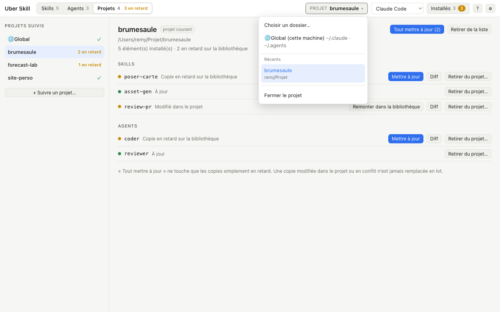
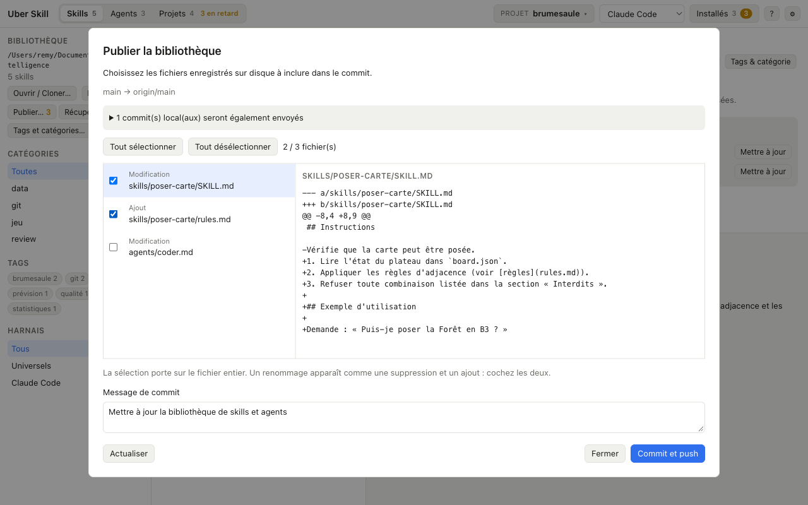
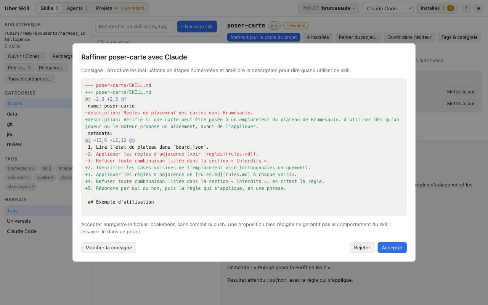

<p align="center">
  
</p>

<h1 align="center">Uber Skill</h1>

<p align="center">
  Une bibliothèque Git pour vos skills et agents Claude Code et Codex,<br>
  et l'outil qui les installe, les compare et les met à jour partout où ils servent.
</p>

<p align="center">
  <a href="#le-problème">Le problème</a> ·
  <a href="#ce-que-fait-uber-skill">Ce que fait Uber Skill</a> ·
  <a href="#captures-décran">Captures</a> ·
  <a href="#installation">Installation</a> ·
  <a href="#ligne-de-commande">CLI</a> ·
  <a href="docs/reference.md">Référence</a>
</p>

---

## Le problème

Les skills et les agents sont des fichiers Markdown que les outils d'IA chargent pour savoir comment faire une tâche. Ils sont précieux, et ils sont partout : dans `.claude/skills` de chaque projet, dans `~/.claude/skills` pour la machine, dans `.agents/skills` pour Codex. Très vite :

- **On ne sait plus quelle copie est la bonne.** Un skill amélioré dans un projet n'est pas celui installé dans les trois autres.
- **Les copies dérivent en silence.** Une modification faite « juste pour ce projet » n'est jamais remontée, et une amélioration de la version de référence n'est jamais redescendue.
- **Rien n'est versionné.** Pas d'historique, pas de sauvegarde, pas de synchronisation entre deux machines.
- **Un skill mal décrit ne se déclenche pas**, et rien ne le signale.

Uber Skill part d'un principe simple : **la bibliothèque est un dépôt Git, chaque installation est une copie suivie**, et l'outil ne fait que comparer et copier. Pas de base de données, pas d'état caché : si vous supprimez l'application, vos fichiers sont exactement là où ils sont.

## Ce que fait Uber Skill

**Une bibliothèque, dans Git.** Vos skills (dossiers avec un `SKILL.md`) et vos agents (fichiers `.md` au format sous-agent Claude Code) vivent dans un dépôt que vous ouvrez ou clonez depuis l'application. Enregistrer et publier sont deux actions distinctes : vous travaillez en local, puis « Publier… » montre les changements et vous choisissez ce qui part dans le commit. « Récupérer… » ramène ce qui a été publié depuis une autre machine, en avance rapide seulement ; les fusions restent à votre outil Git.

**Des installations suivies.** Installer copie un élément dans un projet, ou globalement pour toute la machine, avec un verrou qui mémorise sa provenance et son empreinte. L'application sait ensuite dire, pour chaque copie : à jour, en retard sur la bibliothèque, modifiée dans le projet, en conflit. Elle propose le diff, la mise à jour, ou la remontée de la version du projet dans la bibliothèque. Avant de copier, elle vérifie le dépôt distant pour ne jamais installer une version dépassée.

**Une vue par projet.** L'onglet « Projets » répond à « où ce skill est-il installé, et où est-il en retard ? ». Modifier un skill installé dans quatre projets, puis « Mettre à jour partout » : un seul contrôle, quatre copies à jour, sans jamais écraser une copie modifiée à la main.

**Des skills mieux écrits.** Un lint vérifie le nom, la description, les liens entre fichiers (et corrige les liens cassés en un clic), les tags par rapport à un référentiel versionné avec la bibliothèque. « Raffiner… » envoie un `SKILL.md` à Claude avec votre consigne et affiche la proposition sous forme de diff, à accepter ou rejeter ; le nom et les métadonnées sont verrouillés.

**Le même moteur en ligne de commande.** Le CLI `uber-skill` couvre les mêmes opérations, avec `--json`, pour les scripts et le CI.

## Captures d'écran

**La bibliothèque.** Filtres par catégorie, tag et harnais ; pour chaque élément, son état dans le projet courant, son écart avec le dépôt distant (✎ modifié, ↑ à envoyer, ↓ à récupérer), un globe s'il est installé globalement. Le détail montre où il est installé et propose « Mettre à jour partout ».



**Les projets.** Chaque projet suivi, toutes cibles confondues, avec ce qui est en retard. « Tout mettre à jour » ne touche que les copies simplement en retard ; une copie modifiée dans le projet garde ses propres actions.



**Publier.** Les fichiers modifiés sur disque, y compris hors de l'application, avec leur diff. Vous cochez ce qui part dans le commit ; le reste reste un brouillon local.



**Raffiner avec Claude.** Une consigne, une proposition en diff, rien n'est écrit avant « Accepter ».



## Principes

- **Le disque est la source de vérité.** Une bibliothèque est un dossier `skills/` + `agents/` dans un dépôt Git. Les tags, la catégorie et les harnais requis vivent dans le frontmatter du `SKILL.md`, sous `metadata`, donc restent portables.
- **Rien n'est écrasé sans le dire.** Les confirmations disent ce qui est détruit ; une suppression de la bibliothèque part dans la Corbeille ; une mise à jour groupée épargne les copies modifiées.
- **Git fait le versionnage, pas l'application.** Avance rapide et push sans force uniquement ; branches, fusions et conflits se règlent dans un outil Git.
- **Au plus près de l'usage.** Claude Code et Codex sont couverts de bout en bout ; l'application ne cherche pas à être exhaustive sur les autres outils.
- **Les erreurs ont un code.** Le cœur Rust ne produit aucun texte destiné à l'utilisateur ; l'application les rédige en français et un test échoue si un code n'a pas de libellé.

## Installation

Prérequis : [Rust](https://rustup.rs), [pnpm](https://pnpm.io), Git. Pour « Raffiner… », la commande `claude` de Claude Code, connectée.

```sh
git clone https://github.com/<vous>/uber_skill.git
cd uber_skill/apps/desktop
pnpm install
pnpm tauri dev          # développement
pnpm tauri build        # target/release/bundle/macos/Uber Skill.app et .dmg
```

Au premier lancement, **Ouvrir / Cloner…** pointe sur un dépôt Git contenant `skills/` et `agents/` (un dossier vide initialisé avec `git init` suffit). Le bouton **?** de la barre du haut ouvre le mode d'emploi embarqué.

L'application n'est pas signée avec un certificat Apple : une copie téléchargée demande un clic droit › Ouvrir la première fois.

## Ligne de commande

```sh
cargo build -p uber-skill-cli
./target/debug/uber-skill config set-library ~/ma-bibliotheque
./target/debug/uber-skill list --tag git
./target/debug/uber-skill new review-pr -d "Relit une pull request" -c review --tag git
./target/debug/uber-skill install review-pr -p ~/mon/projet     # -p ~ pour installer globalement
./target/debug/uber-skill status -p ~/mon/projet
./target/debug/uber-skill remote status                         # fetch, commits et fichiers en attente
./target/debug/uber-skill remote publish --all -m "Clarifie review-pr"
./target/debug/uber-skill registry rename tag quality rigor     # dans le référentiel et tous les éléments
./target/debug/uber-skill refine review-pr -m "ajoute un exemple" --apply
./target/debug/uber-skill lint
```

`--json` sur toutes les commandes de lecture, `-k agent` pour travailler sur les agents. La liste complète est dans la [référence](docs/reference.md).

## Sous le capot

```
crates/core      moteur Rust : scan, frontmatter, installation, dérive, Git, référentiel, lint, raffinement
crates/cli       binaire uber-skill
apps/desktop     application Tauri v2 + SvelteKit 5
docs/            référence détaillée et captures d'écran
```

Le cœur est partagé par l'application et le CLI. Ses tests tournent sur de vrais dépôts Git temporaires ; ceux de l'interface passent par une passerelle Tauri simulée.

```sh
cargo test                                    # moteur et CLI
cd apps/desktop && pnpm check && pnpm test    # types, puis interface (vitest)
```

## Documentation

- [Référence](docs/reference.md) : chaque fonctionnalité en détail, ses règles et ses limites.
- [Mode d'emploi](apps/desktop/src/lib/guide.md) : le guide embarqué dans l'application.
- [Feuille de route](TODOS.md) : décisions prises, étapes validées, évolutions à venir.

## Licence

MIT.
